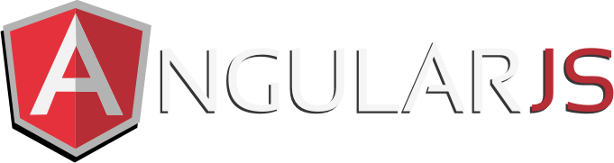

<h1 align="center">
  
</h1>

<!-- <h5 align="center">
  <code><a href="" title="LinkedIn Profile"> LinkedIn</a></code>
  <code><a href="" title="HackerRank Profile"> HackerRank</a></code>
  <code><a href="" title="Stack Overflow Profile"> Stack Overflow</a></code>
  <code><a href="" title="Instagram Profile"> Instagram</a></code>
</h5> -->
 

  Hi, I'm Big Silver, Senior Software Developer & Computer Engineer & Tech Assistant.
   

### 🧐 More About Me:

- 🔭 &nbsp; I’m currently working on **Kunzig Consulting Inc**.
- 🤝 &nbsp; I’m looking for new opportunity.
- 🌱 &nbsp; I’m currently learning new technology; 
- 👨🏻‍💻 &nbsp; Most of my projects are available on [Github](https://github.com/big-silver?tab=repositories)
- 🎨 &nbsp; Using [this svg](https://storyset.com/illustration/javascript-frameworks/amico) and Figma I made 👉
- 💬 &nbsp; Ask me about anything tech related, I am happy to help;
- 📫 &nbsp; Feel free to ping me on [here](https://www.kunzigconsulting.com/about)
- 📝 &nbsp; Checkout my [portfolio](https://www.kunzigconsulting.com/)
- 📚 &nbsp; When I am free, I read fantasy and fiction novels and on the weekend I'd like to explore hiking.

<h2 align="center">🔥 Languages & Frameworks & Tools & Abilities 🔥</h2>
 

  
  
  
  
  
  
  
  
  
  
  
  
  
  
  
  
   
  
  
  
  
  
  
  
  
  
  
  
  
  
  
  
    

<!-- 

  <code></code>
  <code></code>
  <code></code>
  <code></code>
  <code></code>
  <code></code>
  <code></code>
  <code></code>
  <code></code>
  <code></code>
  <code></code>
  <code></code>
  <code></code>
  <code></code>
  <code></code>
  <code></code>
  <code></code>
  <code></code>
  <code></code>
  <code></code>
  <code></code>
  <code></code>
  <code></code>
  <code></code>
  <code></code>
  <code></code>
  <code></code>
  <code></code>
  <code></code>

 -->

<h2 align="center">⚡ Stats ⚡</h2>
 

  

    
    
  

           
  

    
  

   

  

<h2 align="center">👨‍💻 Repositories 👨‍💻</h2>
 

  

      

  
  

      

  
  

      

<h4 align="center">
  <a href="https://github.com/big-silver?tab=repositories" title="Show Repositories">🔎 Show More 🔍</a>
</h4>

**big-silver/big-silver** is a ✨ _special_ ✨ repository because its `README.md` (this file) appears on your GitHub profile.

Here are some ideas to get you started:

- 🔭 I’m currently working on ...
- 🌱 I’m currently learning ...
- 👯 I’m looking to collaborate on ...
- 🤔 I’m looking for help with ...
- 💬 Ask me about ...
- 📫 How to reach me: ...
- 😄 Pronouns: ...
- ⚡ Fun fact: ...

Notes: If you want use this readme, firstly star it please. If you can't align your repositories like this, please change your repository desription to shorter than now. Maybe 4 or 5 word will be good.

<!--  -->

